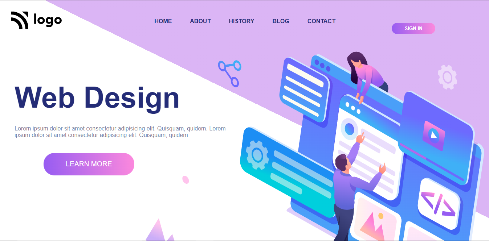

# Project 8 - HTML5 and CSS 

## By Sujal

## [Link for Project 8](https://project-8-mobile-responsive.netlify.app/) 

## What I learned ? How was my experience while making this project?

- This project was the first project provided by full stack web developer bootcamp and it was a great experience while creating this web page.
- I learned how to use HTML and CSS to create a attractive website.
- I learned about various css properties and tags.
- I learned about how to decorate the button and specific text
- I learned how to target only child of the container
- I learned about the properties of positions of elements in the HTML and CSS.
- I learned about linear gradiant property

## This project took almost 5 hours to complete.